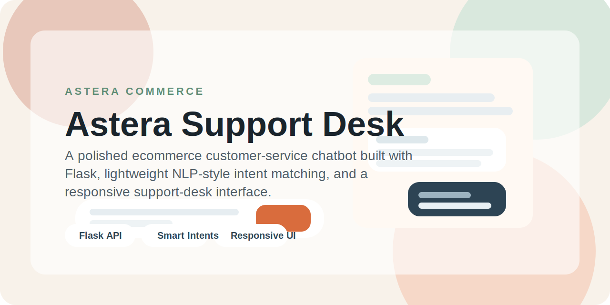
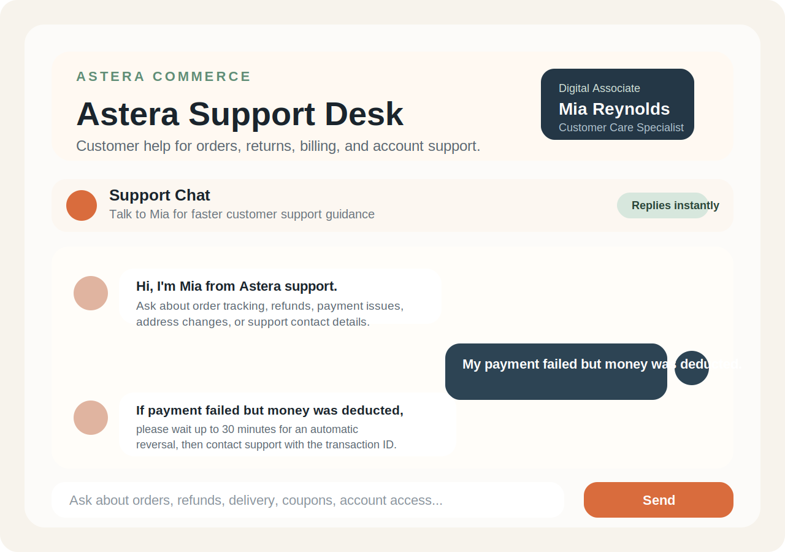
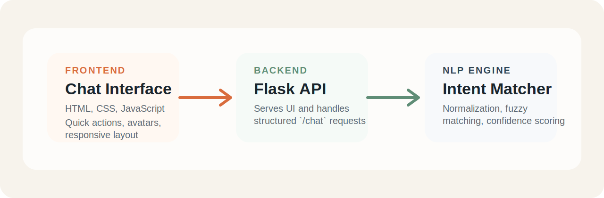

<p align="center">
  
</p>

# Astera Support Desk

<p align="center">
  
  
  
  
</p>

Astera Support Desk is a customer-service chatbot for ecommerce support teams. It is designed to handle common customer queries such as order tracking, delivery delays, refunds, payment issues, address changes, and account-access problems through a polished web interface and a lightweight NLP-style intent engine.

This project was built to demonstrate practical product thinking, backend API design, frontend execution, and applied NLP fundamentals in a way that feels closer to a real support tool than a classroom prototype.

## Portfolio Summary

Astera Support Desk is a polished full-stack chatbot project that demonstrates:

- applied NLP fundamentals through intent detection and fuzzy matching
- backend API design with Flask
- frontend product thinking through a branded, responsive support interface
- realistic business use cases in ecommerce customer support

This is the kind of project that is easy to discuss in interviews because it combines technical implementation with clear product value.

## Live Repository Preview

<p align="center">
  
</p>

## Why This Project Stands Out

- Solves a real business problem by reducing repetitive customer-support workload
- Combines backend logic, UI design, and conversational experience in one project
- Uses explainable intent detection instead of a black-box model, making it easy to discuss in interviews
- Presents the chatbot as a believable product with clean branding and realistic support flows
- Shows readiness for future scaling into live APIs, CRM systems, and ML-based classification

## Product Overview

Astera Support Desk acts as a first-line digital support associate. A customer can open the chat interface, ask a natural question, and receive immediate guidance for common support cases.

Examples:

- "Where is my order?"
- "My payment failed but money was deducted."
- "Can I change my delivery address?"
- "My coupon is not working."
- "I forgot my password."

The chatbot identifies the most likely user intent, returns a relevant answer, and suggests useful follow-up questions to keep the conversation moving.

## Core Features

- Rule-based chatbot with fuzzy intent matching
- Responsive support-desk style frontend
- Flask backend with a dedicated `/chat` API endpoint
- Intent detection using keyword overlap and string similarity
- Support for realistic ecommerce issues such as refunds, payment failures, delayed delivery, and account help
- Quick action suggestions for smoother user interaction
- Graceful fallback responses for unsupported questions

## Supported Customer Intents

- Greeting
- Order tracking
- Shipping information
- Delivery delays
- Refund policy
- Return process
- Order cancellation
- Payment methods
- Payment failures
- Account help
- Address change
- Product availability
- Promo code issues
- Store hours
- Contact support
- Goodbye

## Tech Stack

- Python
- Flask
- HTML
- CSS
- JavaScript
- `difflib.SequenceMatcher` for lightweight fuzzy matching

## Architecture Snapshot

<p align="center">
  
</p>

## System Design

### 1. Frontend

The frontend provides a modern support-chat experience with:

- branded hero section
- conversational chat layout
- avatar-based message styling
- quick-action suggestion chips
- responsive design for desktop and mobile

### 2. Backend

The Flask server:

- serves the main UI
- accepts chat messages through a JSON API
- routes user messages to the chatbot engine
- returns structured responses with reply text, detected intent, confidence score, and follow-up suggestions

### 3. Chatbot Engine

The chatbot engine:

- normalizes user input
- compares it against predefined intent patterns
- scores matches using keyword overlap and fuzzy similarity
- selects the best intent above a confidence threshold
- falls back gracefully when no strong match is found

## Project Structure

```text
Astera Support Desk/
|-- app.py
|-- chatbot_engine.py
|-- requirements.txt
|-- README.md
|-- static/
|   |-- style.css
|   `-- script.js
|-- templates/
    `-- index.html
```

## What Recruiters Can Look At

### Product Thinking

- The chatbot is framed as a usable support experience, not just a technical demo
- The interface and conversation design were shaped around realistic customer needs

### Engineering Skills

- Clean separation between UI, API, and chatbot logic
- Structured JSON responses between frontend and backend
- Intent matching logic that is simple, explainable, and extensible

### UX and Frontend Execution

- Visually polished interface
- Smooth chat interaction with suggestions and typing feedback
- Mobile-friendly responsive layout

### Extensibility

- Easy to connect to order databases or courier APIs
- Easy to replace the rule-based engine with an ML or LLM-based classifier later

## GitHub About Section

If you want to use a short description in the GitHub repository "About" field, use:

```text
Polished Flask-based customer support chatbot with rule-based NLP, fuzzy intent matching, and a responsive ecommerce help desk UI.
```

## Local Setup

### 1. Create a virtual environment

```bash
python -m venv .venv
```

### 2. Activate the environment

```bash
.venv\Scripts\activate
```

### 3. Install dependencies

```bash
pip install -r requirements.txt
```

### 4. Run the application

```bash
python app.py
```

### 5. Open in browser

```text
http://127.0.0.1:5000
```

## Example Questions To Test

- Where is my order?
- My order is delayed.
- I want a refund.
- My payment failed but money was deducted.
- Can I change my delivery address?
- My coupon code is not working.
- I forgot my password.
- How can I contact support?

## Future Improvements

- Add real order-tracking integration
- Add customer authentication and profile history
- Store chat logs or support tickets in a database
- Add analytics for common support issues
- Upgrade intent detection with machine learning or LLM-based routing
- Deploy the app to Render, Railway, or another cloud platform

## Interview Talking Points

- Why a rule-based NLP system can be a strong first version for support automation
- How fuzzy matching improves intent detection over exact keyword matching
- Why support-chat UX matters as much as backend accuracy
- How this architecture can evolve into a production-ready support assistant

## License

This project is open for educational and portfolio use.
